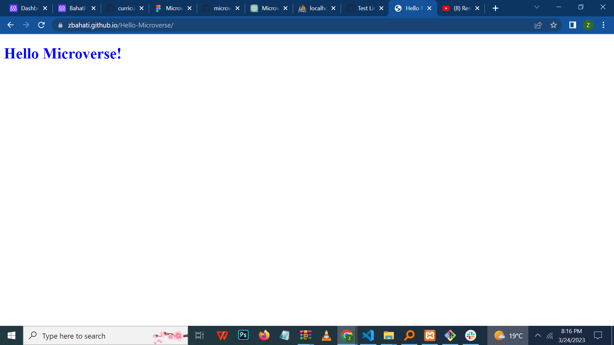

<a name="readme-top">Portfolio</a>

  
   

This Portfolio project consist of two section one is header locate at the top of the pages and  other is main section that is locate under header, this project is designed using html and css and setup consist of linters in it.

# 📖 [portfolio]

**[Portfolio]** is a web application that help us to set up the linters for the project,that we will use to test the project.and then we design and Deploy it to the github
#### this project have two section one is header with mobile first and one section after header.

### header-section features this is the branch used to to add files and folder including index.html and style.css to make header and main sections of the page

- **[Test Linters of HTML and CSS ]**

(<a href="#readme-top">back to top</a>)

- [Live Demo Link](https://zbahati.github.io/Portfolio/)

(<a href="#readme-top">back to top</a>)

to get start with this testing for new developer we could first start with installing the following things linters,lighthouse, .hintrc,stylelintrc.json,
then create the index.html and style.css, to create and style the mobile first

### Prerequisites
you need to have editor for writing  the codes and
you need to have the gitHub, and Git to test how is the project

### install the neccessary command to run the project
install webhint using npm init -y, then install webhint by npm install --save-dev hint@7.x
install lighthouse with npm install -g lighthouse

### Setup

Clone this repository to your desired folder:

Use the command for clone the report
git clone https://github.com/zbahati/Portfolio.git

### Deployment

You can deploy this project using GitHub by going on
1.Setting
2.pages
3. publish the page

(<a href="#readme-top">back to top</a>)

## 👥 Bahati Zirimwabagabo <a name="https://github.com/zbahati">Zbahati</a>

👤 **Author**

- GitHub: [@githubhandle](https://github.com/zbahati)
- Twitter: [@twitterhandle](https://twitter.com/@b2_bahati)
- LinkedIn: [LinkedIn](https://linkedin.com/in/zirimwabagabo-bahati)

(<a href="#readme-top">back to top</a>)

## 📝 License 

This project is [MIT](./License.md) licensed.

(<a href="#readme-top">back to top</a>)
